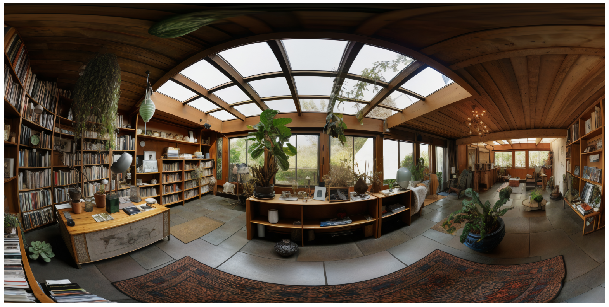
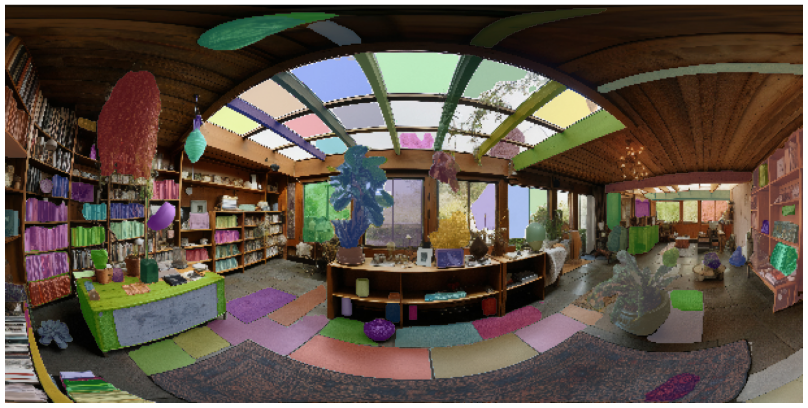

# SAM-360-image

# SAM (Segment Anything Model) Usage Example

This repository demonstrates how to use the SAM (Segment Anything Model) from Meta AI for image segmentation.

## Installation

### SAM Library
To install SAM, run the following command:

```bash
!pip install git+https://github.com/facebookresearch/segment-anything.git
```

## Other Dependencies
You will also need the following libraries:
```
!pip install opencv-python pycocotools matplotlib onnxruntime onnx
```

## Importing Libraries and Reading a Sample Image
First, we need to import necessary libraries and read an image using OpenCV.

```
import cv2
import matplotlib.pyplot as plt
import numpy as np

image_path = 'shot-panoramic-composition-library.jpg'
image = cv2.imread(image_path)
image = cv2.cvtColor(image, cv2.COLOR_BGR2RGB)

plt.figure(figsize=(20,20))
plt.imshow(image)
plt.axis('off')
plt.show()
```

<!-- -->

## Defining Helper Function for Annotations
This function helps in displaying the annotations.
```
def show_anns(anns):
    if len(anns) == 0:
        return
    sorted_anns = sorted(anns, key=lambda x: x['area'], reverse=True)
    ax = plt.gca()
    ax.set_autoscale_on(False)
    img = np.ones((sorted_anns[0]['segmentation'].shape[0], sorted_anns[0]['segmentation'].shape[1], 4))
    img[:,:,3] = 0
    for ann in sorted_anns:
        m = ann['segmentation']
        color_mask = np.concatenate([np.random.random(3), [0.35]])
        img[m] = color_mask
    ax.imshow(img)
```

## Importing SAM Model
```
from segment_anything import sam_model_registry, SamAutomaticMaskGenerator, SamPredictor
```

## SAM Initialization
Here, we initialize the SAM model and prepare for processing. If using Google Colab, additional installation and preparation steps are handled.
```
sam_checkpoint = "sam_vit_h_4b8939.pth"
model_type = "vit_h"
using_colab = True

if using_colab:
    import torch
    import torchvision
    print("PyTorch version:", torch.__version__)
    print("Torchvision version:", torchvision.__version__)
    print("CUDA is available:", torch.cuda.is_available())
    import sys
    !{sys.executable} -m pip install opencv-python matplotlib
    !{sys.executable} -m pip install 'git+https://github.com/facebookresearch/segment-anything.git'

    !mkdir images
    !wget -P images https://raw.githubusercontent.com/facebookresearch/segment-anything/main/notebooks/images/dog.jpg

    !wget https://dl.fbaipublicfiles.com/segment_anything/sam_vit_h_4b8939.pth
```

## Analyzing Image Dimensions
We can analyze the dimensions of the image, including height, width, and the number of channels.
```
# get dimensions of image
dimensions = image.shape

# height, width, number of channels in image
height = image.shape[0]
width = image.shape[1]
channels = image.shape[2]

print('Image Dimension    : ',dimensions)
print('Image Height       : ',height)
print('Image Width        : ',width)
print('Number of Channels : ',channels)
```

## Resizing Image
We resize the image to new dimensions for further processing.
```
# Calculate the new dimensions
new_width = width // 10
new_height = height // 10

# Resize the image to the new dimensions
resized_image = cv2.resize(image, (new_width, new_height))

plt.figure(figsize=(10,10))
plt.imshow(resized_image)
plt.axis('off')
plt.show()

# Print new dimensions
new_dimensions = resized_image.shape
print('New Image Dimension: ', new_dimensions)
print('New Image Height   : ', new_dimensions[0])
print('New Image Width    : ', new_dimensions[1])
```

## SAM Model Registry & Mask Generation
We use the SAM model to generate masks for the image.
```
image = resized_image

# SAM model registry & SamAutomaticMaskGenerator & generate

sam = sam_model_registry[model_type](checkpoint=sam_checkpoint)
mask_generator = SamAutomaticMaskGenerator(sam)
masks = mask_generator.generate(image)

print(len(masks))

plt.figure(figsize=(20,20))
plt.imshow(image)
show_anns(masks)
plt.axis('off')
plt.show()
```

<!-- -->

## Saving and Downloading the Image (Google Colab)
We can save and download the processed image using the following code:
```
from google.colab import files
output_path = 'test.jpg'
cv2.imwrite(output_path, image)
files.download(output_path)
```
## Conclusion
This example illustrates how to use the SAM model for image segmentation. You can modify the code to suit your specific use case or to process a different image.


